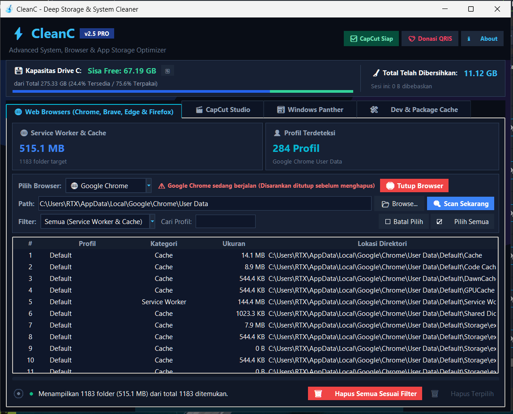

# CleanC



**CleanC** is a focused Windows storage cleaner for browser caches, Service Worker data, CapCut leftovers, developer caches, and selected Windows logs.

## Highlights

- Chrome-first browser cleaning with support for Brave, Edge, and Firefox
- Safe cache targets: Cache, Code Cache, GPUCache, DawnCache, GrShaderCache, and ShaderCache
- Service Worker cleanup across browser profiles
- CapCut cache, project, and old-version cleanup
- Developer cache cleanup for Playwright, npm, pip, pnpm, and Node-Gyp
- Windows cleanup targets for temporary files, thumbnails, logs, and web cache
- Confirmation prompts, process checks, locked-file reporting, and freed-space statistics
- Modern dark UI with a subtle nebula accent and transparent CleanC branding

## Download

The Windows portable executable is available in the [v1.0.0 release](https://github.com/effands/CleanC/releases/tag/v1.0.0).

Run `CleanC.exe` directly. No installation is required.

## Development

```bash
python3 -m py_compile clean_chrome_service_workers.py service_worker_cleaner_gui.py
python3 service_worker_cleaner_gui.py
```

Build the Windows executable with PyInstaller (on Windows or CI):

```bash
pyinstaller --clean --noconfirm CleanC.spec
```

The output is written to `dist/CleanC.exe`.

## CLI examples

```bash
python3 clean_chrome_service_workers.py --browser chrome --type cache
python3 clean_chrome_service_workers.py --windows-info
python3 clean_chrome_service_workers.py --clean-windows thumbnail-cache
```

## System Cleanup menu

## AppData Explorer

The **AppData Explorer** tab scans Users, Current User, Local, LocalLow, Roaming, or Disk C:.
Scanning does not delete files. It lists folders and files in descending size order, with recursive
file counts. Double-click a folder to explore its children, use Up to return, or
open the location in Windows File Explorer. Scans run in the background and can
be cancelled. Sizes are logical file sizes rather than allocated disk space;
Completed items appear immediately during scanning and remain sorted largest
first. Cancelling retains completed results and marks the analysis incomplete.
access errors produce partial totals and junctions/symbolic links are excluded.
Hidden and system folders are included automatically, including AppData and
hidden folders inside user profiles. Choose Users to start at `C:\Users`, or
Current User to start at the signed-in user's home folder.
Folders with immediate subfolders show a **+** prefix. Select items and use
**Delete Selected** to move them to the Windows Recycle Bin after confirmation.
Deletion is unavailable during a scan, follows the existing license gate, blocks
root/system directories and redirected paths, and reports failures. Moving files
to Recycle Bin does not free disk space until the bin is emptied.
Disk C: scans may take several minutes. Administrator permissions can improve
coverage of protected folders.

## System Cleanup categories

**ixBrowser** is available as an optional category in System Cleanup. It targets
`%APPDATA%\ixBrowser\Browser Data` and deletes contents of its child folders,
then removes empty folders. Folders named `extension` (case-insensitive) are
protected at every depth, including all their contents. A parent containing a
protected folder is retained. Files directly in Browser Data and the root folder
are retained. This can remove browser profiles and sessions; it is not selected
automatically, requires explicit confirmation, and checks that ixBrowser is
closed. Junctions/symlinks are excluded. Only scanned files are deleted, and
locked files are reported.

CapCut's scope selector also offers **Entire User Data (includes settings)**.
This scans all direct files and folders under `%LOCALAPPDATA%\CapCut\User Data`,
including Config, Presets, Download, Resources, Cache and Projects. Select items
or delete all displayed items (search/type filters still apply). Confirmation
warns that drafts, settings, presets, downloaded resources and sign-in data may
be removed. CapCut must be closed. The User Data root is retained; redirected
folders are skipped and items containing nested reparse points cannot be deleted.

The main notebook now includes **System Cleanup**. Scan shows grouped categories,
file counts, sizes, and locations. Click a category to select it, inspect its
details, then choose **Clean Selected**. Scanning does not delete files.

Supported file rules: user/Windows temporary files older than 24 hours, memory
dumps, Windows `*.log` files, INetCache, thumbnail databases, Remote Desktop
cache, Chrome profile Cache/Code Cache/GPUCache, and BrowserMetrics `*.pma` files.
Diagnostic dumps and logs are not selected automatically. Reparse points are
excluded. Cleanup rechecks eligibility and only deletes files from the reviewed
scan; locked or inaccessible files are reported. Run elevated for protected
Windows locations. Rescan after cleanup to see what remains.

Telegram, Run command history, Chrome browsing/download history, and last download
location are **not directly scanned or deleted by this menu**. Telegram and
Chrome help buttons open their respective documentation. These data require
separate application/database/registry handling; deleting entire profile or
Telegram `tdata` directories is not a cache cleanup rule.

Rule references:

- [Microsoft: temporary files and storage cleanup](https://support.microsoft.com/en-us/windows/experience/storage-filemanagement/free-up-drive-space-in-windows)
- [Microsoft: small memory dumps](https://learn.microsoft.com/en-us/troubleshoot/windows-client/performance/read-small-memory-dump-file)
- [Chromium: profile data locations](https://chromium.googlesource.com/chromium/src/+/HEAD/docs/user_data_dir.md)
- [Chromium: disk cache](https://www.chromium.org/developers/design-documents/network-stack/disk-cache/)
- [BleachBit: Explorer thumbnail and Run rules](https://github.com/bleachbit/bleachbit/blob/master/cleaners/windows_explorer.xml)
- [Chromium: download history database](https://chromium.googlesource.com/chromium/src/+/refs/heads/main/components/history/core/browser/download_database.cc)

## Safety

CleanC targets disposable cache and log data. Browser history, bookmarks, passwords, preferences, and CapCut project drafts are not silently removed. Close the relevant application before cleaning for the best result. Some Windows log files require Administrator permissions or may be skipped when locked by the operating system.

## License

This project is provided for personal and educational use. Review the target list before confirming a cleanup operation.

